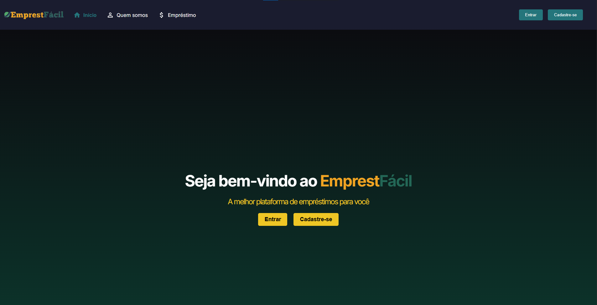

# EmprestFacil Frontend

Este repositório contém o front-end do sistema **EmprestFacil**, uma aplicação para gerenciar empréstimos, agiotas e usuários. O projeto utiliza **Next.js** com **TypeScript** para a construção da interface de usuário.



## Tecnologias Utilizadas

- **Next.js**: Framework React para a construção da interface de usuário, com renderização server-side e client-side.
- **TypeScript**: Superset do JavaScript que adiciona tipagem estática ao código.
- **Axios**: Biblioteca para realizar chamadas HTTP à API backend.
- **React Hooks**: Hooks para gerenciamento de estado e ciclo de vida dos componentes.

## Estrutura do Projeto

- `app/`: Contém as páginas e componentes principais do front-end.
  - `profile/`: Página de edição de perfil de usuário.
  - `loan/`: Página para listar e criar empréstimos.
  - `agiota/`: Página para gerenciar agiotas.
- `public/`: Arquivos públicos, como imagens e outros recursos estáticos.
- `utils/`: Funções utilitárias usadas em várias partes do projeto.
- `next.config.mjs`: Configurações de compilação e execução do Next.js.
- `package.json`: Gerenciamento de dependências e scripts de automação.
- `tsconfig.json`: Configurações do TypeScript.

## Instalação e Configuração

1. **Clone o repositório:**
   ```bash
   git clone <url-do-repositorio>
   ```

2. **Instale as dependências:**
   No diretório do projeto, execute:
   ```bash
   npm install
   ```

3. **Rodando a aplicação:**
   Inicie o servidor de desenvolvimento:
   ```bash
   npm run dev
   ```
   A aplicação será iniciada em [http://localhost:3000](http://localhost:3000).

## Integração com o Backend

Este projeto está configurado para consumir uma API REST, que faz o gerenciamento dos dados de usuários, emprestadores e empréstimos. Certifique-se de que o backend (disponível em outro repositório) esteja rodando para que a aplicação funcione corretamente.

